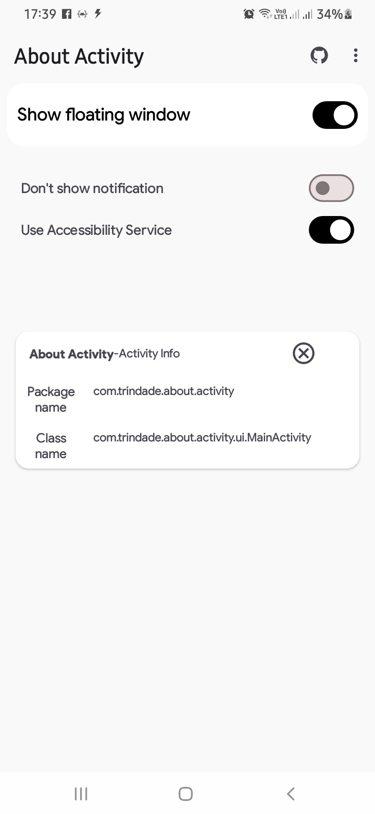
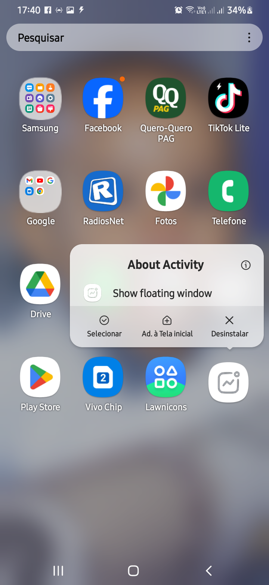

  

<h1 align="center">
  <b>About Activity</b>
</h1>

An useful tool for Android Developers &amp; Reversers, which shows the package name and class name of current activity which you are in

   

   
        
    
        <a href="https://github.com/aquilesTrindade/about-activity/releases">
        
                
    

  

 

<!--  -->

<h1 align="left">
  <b>&nbsp;How it works</b>
</h1>
It uses accessibility service api and package usage stats to monitor app activity changes and show it in a freely moveable popup window

<h1 align="left">
  <b>&nbsp;Screenshots</b>
</h1>

<h1 align="left">
  <b>&nbsp;Credits</b>
</h1>

* [Codehasan](https://github.com/codehasan) for [Project Base](https://github.com/codehasan/Current-Activity).

<h1 align="left">
  <b>&nbsp;License</b>
</h1>

  
About Activity is licensed under [GNU General Public License](https://www.gnu.org/licenses/gpl-3.0.html) v3 or later.

---